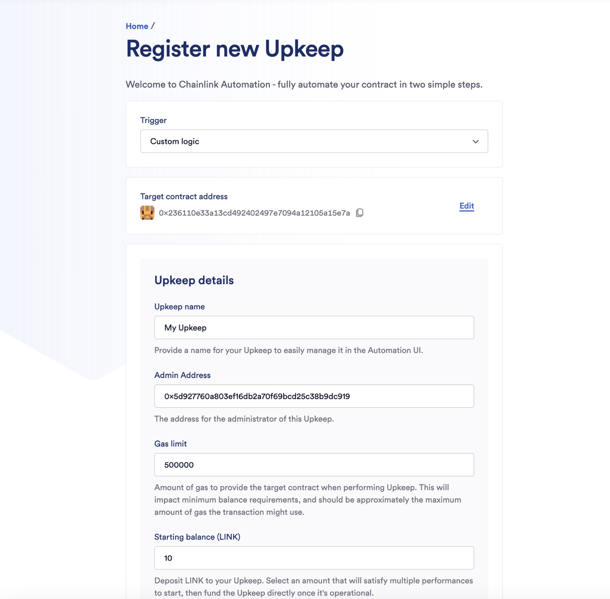

# Proveably Random Smart Contract Lottery

## About

This code consists of a smart contract for a decentralized lottery game.

### What we want it to do?

1. Users can enter by paying the required entrance fee
2. A random Winner will be automatically chosen after every x seconds
3. All the ticket fees collected during the draw will get transferred to the Winner
4. Choosing the winner will happen programatically with the help of Chainlink VRF (Randomness )and Chainlink Automation (Time based trigger).

> We use `0.1.0` of the `foundry-devops` package which doesn't need to have `ffi=true`

## Getting Started

### Requirements

- [git](https://git-scm.com/book/en/v2/Getting-Started-Installing-Git)
  -- You'll know you did it right if you can run `git --version` and you see a response like `git version x.x.x`

- [foundry](https://getfoundry.sh/)
  -- You'll know you did it right if you can run `forge --version` and you see a response like `forge 0.2.0 (816e00b 2023-03-16T00:05:26.396218Z)`

### Quickstart

```
git clone https://github.com/Sushobhan03/Smart-Contract-Lottery.git
cd foundry-smart-contract-lottery
forge build
```

## Usage

### Start a local node

```
make anvil
```

### Library

If you're having a hard time installing the chainlink library, you can optionally run this command.

```
forge install smartcontractkit/chainlink-brownie-contracts@0.6.1 --no-commit
```

### Deploy

This will default to your local node. You need to have it running in another terminal in order for it to deploy.

```
make deploy
```

### Deploy - Other Network

[see below](#deployment-to-a-testnet-or-a-mainnet)

### Testing

There are 4 tiers to testing.

1. Unit
2. Integration
3. Forked
4. Staging

Only tests for 1, 2 and 3 have been written in this project.

For running tests on local anvil chain:

```
make test
```

or

For running tests on forked sepolia network:

```
make test-sepolia
```

### Test Coverage

```
make coverage
```

## Deployment to a testnet or a mainnet

1. Setup environment variables
   You'll want to set your `SEPOLIA_RPC_URL` and `SEPOLIA_PRIVATE_KEY` as environment variables. You can add them to a `.env` file.

- `SEPOLIA_PRIVATE_KEY`: The private key of your account (like from [metamask](https://metamask.io/)).

- `SEPOLIA_RPC_URL`: This is url of the sepolia testnet node you're working with. You can get setup with one for free from [Alchemy](https://alchemy.com/?a=673c802981)

Optionally, add your `ETHERSCAN_API_KEY` if you want to verify your contract on [Etherscan](https://etherscan.io/) or [Sepolia-Etherscan](https://sepolia.etherscan.io/).

1. Get testnet ETH

Head over to [faucets.chain.link](https://faucets.chain.link/) and get some testnet ETH. You should see the ETH show up in your metamask.

2. Deploy

```
make deploy ARGS="--network sepolia"
```

This will setup a ChainlinkVRF Subscription for you. If you already have one, update it in the `scripts/HelperConfig.s.sol` file. It will also automatically add your contract as a consumer.

3. Register a Chainlink Automation Upkeep

[You can follow the documentation if you get lost.](https://docs.chain.link/chainlink-automation/compatible-contracts)

Go to [automation.chain.link](https://automation.chain.link/new) and register a new upkeep. Choose `Custom logic` as your trigger mechanism for automation. Your UI will look something like this once completed:



### Scripts

After deploying to a testnet or local net, you can run the scripts.

Using cast deployed locally example:

```
cast send <LOTTERY_CONTRACT_ADDRESS> "enterLottery()" --value 0.1ether --private-key <SEPOLIA_PRIVATE_KEY> --rpc-url $SEPOLIA_RPC_URL

```

or, to create a ChainlinkVRF Subscription:

```
make createSubscription ARGS="--network sepolia"
```

### Estimate gas

You can estimate how much gas things cost by running:

```
forge snapshot
```

And you'll see an output file called `.gas-snapshot`

## Formatting

To run code formatting:

```
forge fmt
```

# Thank you!
